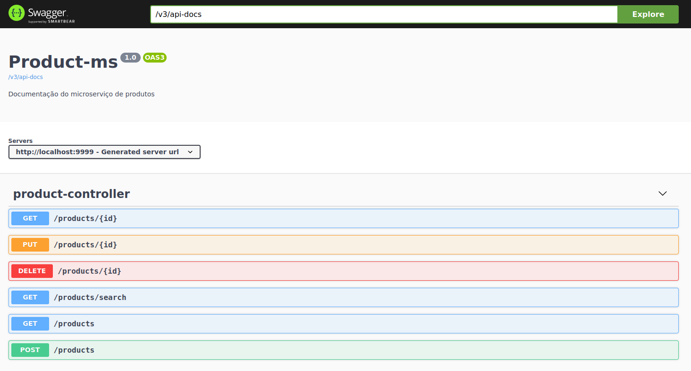

# Product-ms
Microserviço de produtos - Desafio

Tecnologias utilizadas:

- Java - Linguagem de programação utilizada
- Webflux - Módulo inserido no framework que possibilita aplicações web com Spring trabalhar de forma reativa
- Spring Boot - Framework utilizado para desenvolvimento de serviços com java
- MongoDB - Banco de dados não relacional utilizado para persistência
- Spotless - Identação de código e remoção de imports não utilizados
- Swagger - Documentação da API
- Junit - Testes unitários
